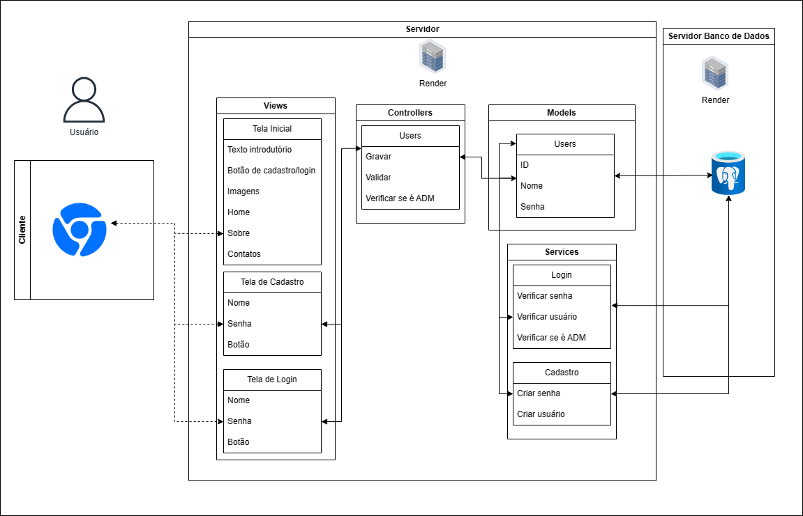
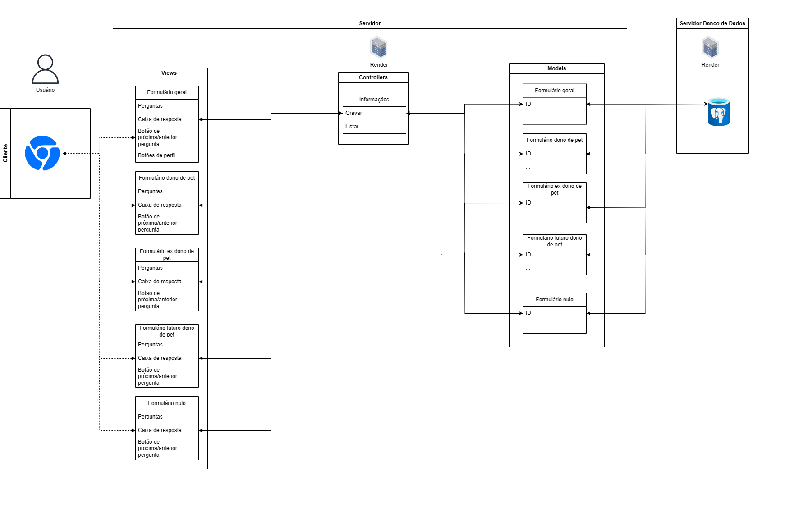
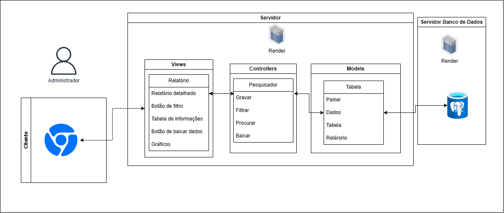

MVC é um padrão de arquitetura de software que é dividida em 3 camadas:
    View: Camada de interação com usuário
    Controller: Camada de controle
    Model: Camada de manipulação dos dados
Ele está sendo utilizado, principalmente, pela facilidade de escalabilidade:

Figura 1 - MVC usuário

Fonte: Material produzido pelo autor (2024)

&nbsp;&nbsp;&nbsp;&nbsp;O MVC acima (figura 1) representa 3 telas para o usuário, sendo elas a inicial, de cadastro e de Login. A tela inicial não se conecta com o controller, visto que não haverá a troca de informações entre as informações lá dispostas. Por outro lado, as telas de login e cadastro precisam ser verificadas e enviadas ao banco de dados, por esse motivo, passa pelo controller e, logo em seguida, para o model. Nesse caso em especifico temos o Services, responsável por verificar validar as informações no banco de dados.

Figura 2 - MVC usuário

Fonte: Material produzido pelo autor (2024)

&nbsp;&nbsp;&nbsp;&nbsp;O MVC acima (figura 2) representa as telas dos diversos formulários presentes no site. O primeiro formulário geral conta com um botão de perfil, esse botão redireciona ele para o formulário mais condizente com o seu perfil. Com exceção disso, todos os formulários possuem tópicos iguais, por esse motivo, possuem os mesmos atributos.
As respostas desse formulário são enviadas, junto com o ID do usuário, para o controller, que faz a comunicação com o Models, salvando no banco de dados.

Figura 3 - MVC usuário

Fonte: Material produzido pelo autor (2024)

&nbsp;&nbsp;&nbsp;&nbsp;O MVC acima (figura 3) representa a interação do administrador com o relátorio final. Ele tem acesso às respostas, que podem ser filtradas, e um relátorio.